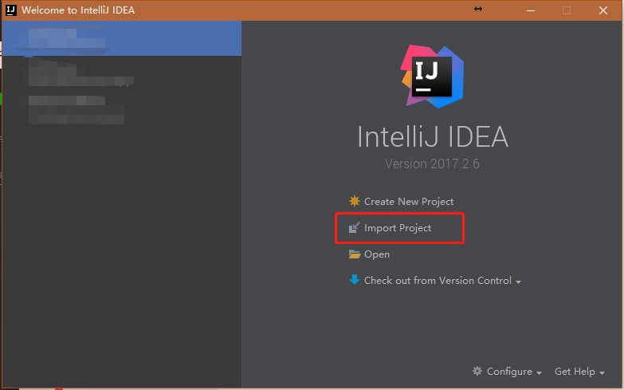
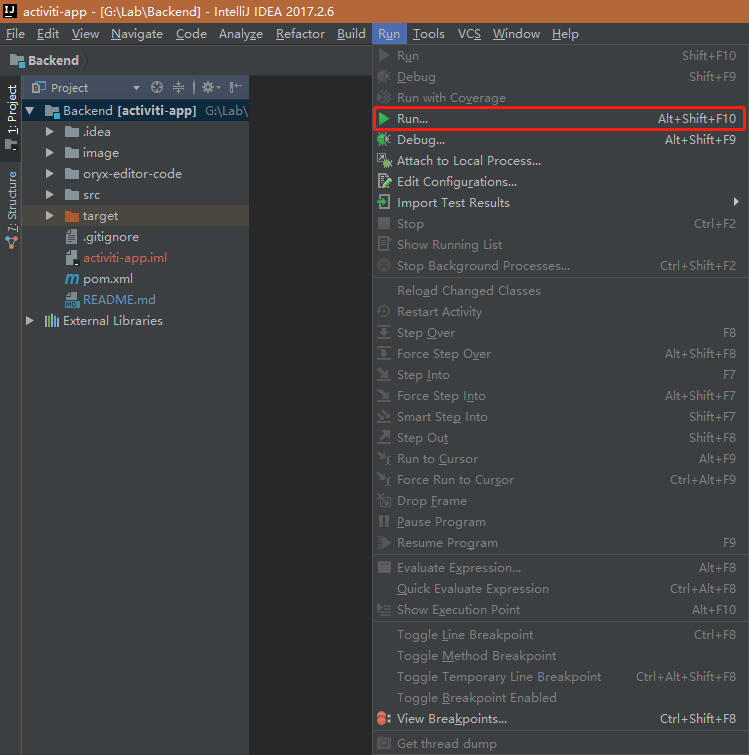
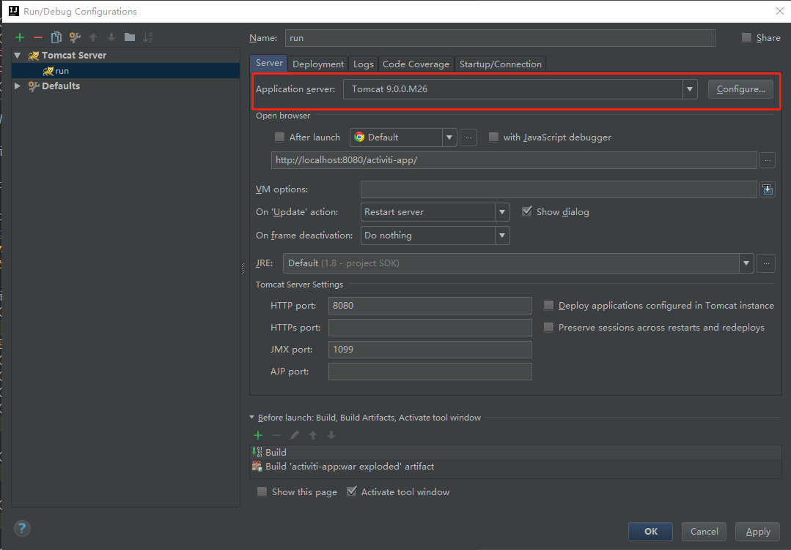
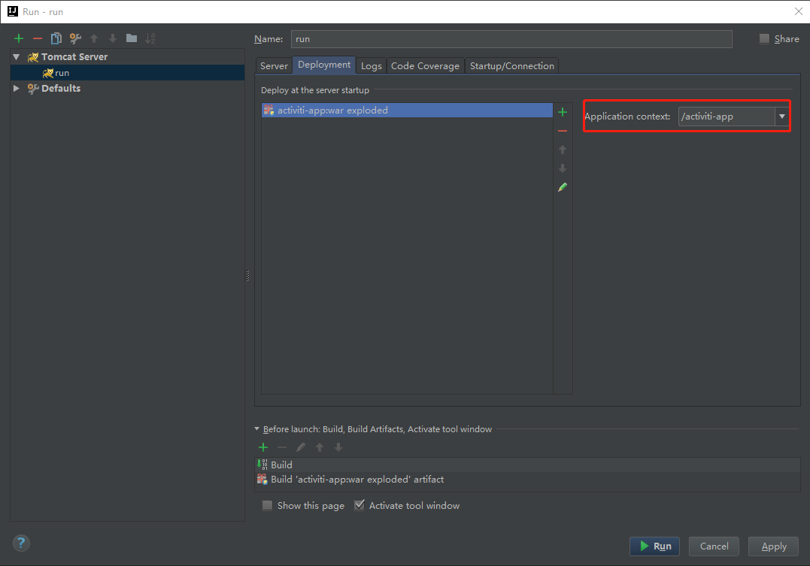
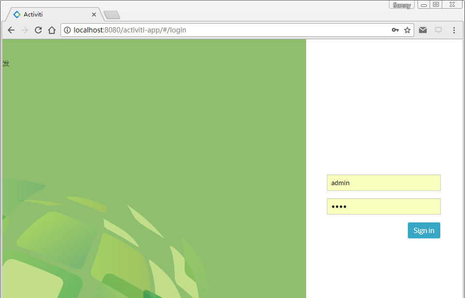
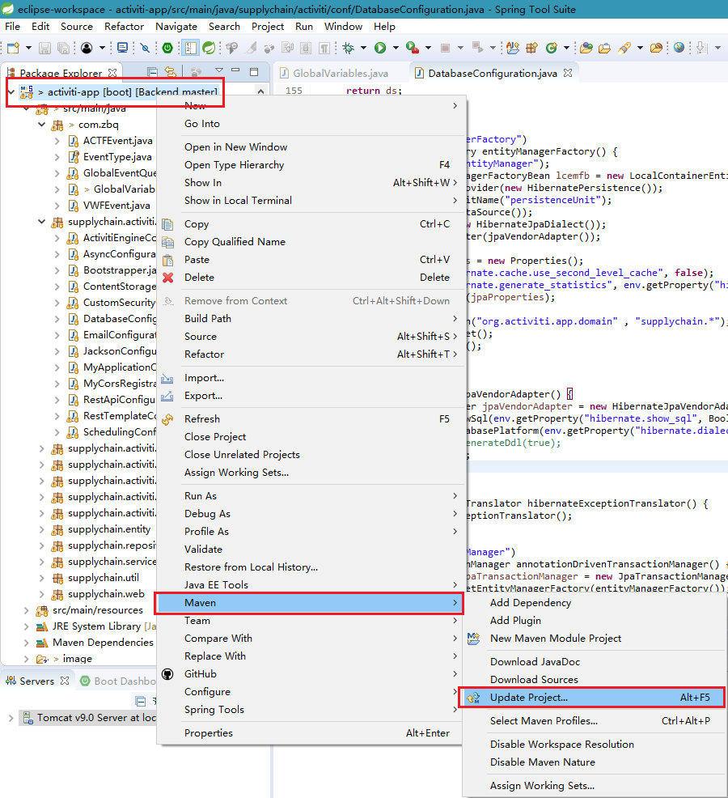
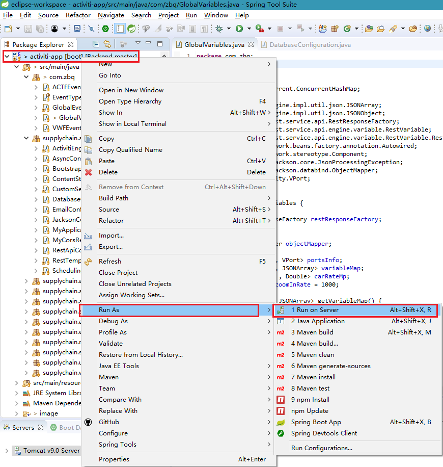
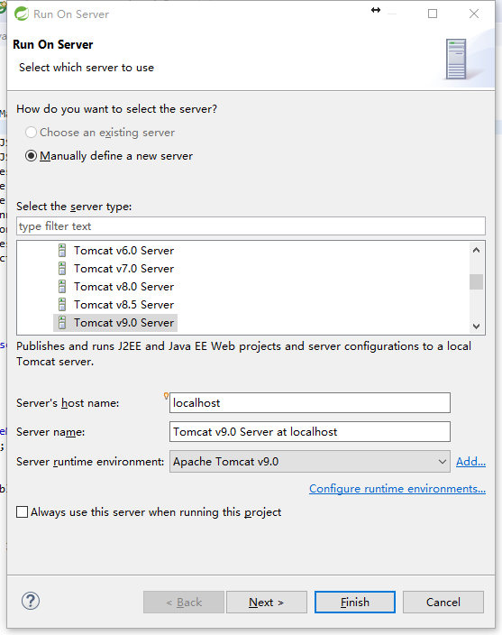

# README
- [Run in Intellij IDEA (recommend)](https://github.com/sonnyhcl/backend#run-in-intellij-idea)
- [Run in Spring Tool Suite](https://github.com/sonnyhcl/backend#run-in-spring-tool-suite)

## Run in Intellij IDEA
1.  Download development tool:

    IDE: [Intellij IDEA](https://www.jetbrains.com/idea/download)
    
    Web Container: [Tomcat](http://tomcat.apache.org/)
    
    Database: [Mysql](https://www.mysql.com/)

2.  Clone Source Code:

    `git clone git@github.com:sonnyhcl/Backend.git`

3.  Import Project in IDEA:  

    -   Choose `Import Project`.
        

    -   Choose the `directory path` which you clone the source code
    -   Choose import project from external model `maven`
    -   Pass `select profiles`
    -   Pass `select maven projects to import`.
    -   Carefully choose `project JDK`
    -   `Finish`
    -   Wait for IDEA to download maven dependencies

6.  Configure Mysql

    First make sure you have installed `mysql`. 
    
    You can edit your own mysql `databasename/username/password` in [activiti-app.properties](https://github.com/sonnyhcl/Backend/blob/master/src/main/resources/META-INF/activiti-app/activiti-app.properties)

5.  Configure Tomcat:
    -   Click `Run`
        
    -   Edit `Run Configuration`
    -   Click the `plus` in left-up corner
    -   Choose `Tomcat Server`
    -   Choose `local`
    -   Configure tomcat in idea
        

    -   Configure artifact
        

    -   Configure application-context: `/activiti-app`
        

7.  Run Activiti

    Run Activiti and visit [https://localhost:8080/activiti-app](https://localhost:8080/activiti-app) in the browser
    ```
    username: admin
    password: test
    ```
    

8.  Import bpmn:

    After running the project and logging in  the system , upload process models under the root directory `src/main/resources`, such as `Supply_Chain_pool.bpmn`, `Weagon_Test.bpmn`, then create app for it  and publish your app, then  go to processes page to start the selected process.
    

## Run in `Spring Tool Suite`
1.  Download development tool:

    IDE: [Spring-Tool-Suite-3.9.0.RELEASE](https://spring.io/tools/sts/all)
    
    Web Container: [Tomcat](http://tomcat.apache.org/)
    
    Database: [Mysql](https://www.mysql.com/)

2.  Clone Source Code:

    `git clone git@github.com:sonnyhcl/Backend.git`

3.  Import Project:  

    To import Backend as a Maven project in IDEA, follow the steps below :
    `File -> Import -> Maven -> Existing Maven Projects -> Select Root Directory -> Finish`
    
4.  Update Maven Dependencies:

    Right click the project name `activiti-app`, then enter -> `Maven` -> `Update Project`, waiting to load dependencies.
    

5.  Configure Tomcat:

    After loading is completed, right-click the project name, followed by `Run As `-> `Run On Server` -> `choose Tomcat Server` -> `Finish`.

    

    

6.  Configure Mysql

    First make sure you have installed mysql. You can edit your own mysql `databasename/username/password` in [activiti-app.properties](https://github.com/sonnyhcl/Backend/blob/master/src/main/resources/META-INF/activiti-app/activiti-app.properties)

7.  Run Activiti

    Visit [https://localhost:8080/activiti-app](https://localhost:8080/activiti-app) in the browser, enter the login page,
    ```
    username: admin
    password: test
    ```
    

8.  Develop:

    After running the project and logging in  the system , upload process models under the root directory `src/main/resources`, such as [Supply_Chain_pool.bpmn20.xml](https://github.com/sonnyhcl/Backend/blob/master/src/main/resources/Supply_Chain_pool.bpmn20.xml), then create app for it  and publish your app, then  go to processes page to start the selected process.
    

> Attention: In order to perform well, The `Backend` project must be coordinated with the `Frontend` project.
